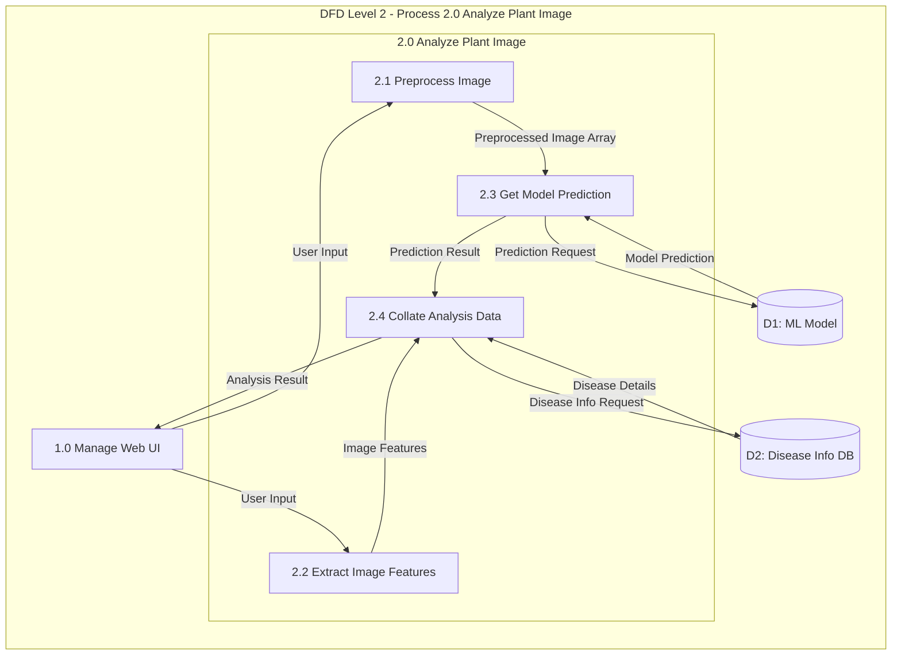

```mermaid
graph TD
    subgraph DFD Level 2 - Process 2.0 Analyze Plant Image
        direction TB

        P1_ext[1.0 Manage Web UI]

        subgraph 2.0 Analyze Plant Image
            direction TB
            P2_1[2.1 Preprocess Image]
            P2_2[2.2 Extract Image Features]
            P2_3[2.3 Get Model Prediction]
            P2_4[2.4 Collate Analysis Data]
        end

        DS1[(D1: ML Model)]
        DS2[(D2: Disease Info DB)]

        P1_ext -- User Input --> P2_1
        P1_ext -- User Input --> P2_2
        P2_1 -- Preprocessed Image Array --> P2_3
        P2_2 -- Image Features --> P2_4

        P2_3 -- Prediction Request --> DS1
        DS1 -- Model Prediction --> P2_3
        P2_3 -- Prediction Result --> P2_4

        P2_4 -- Disease Info Request --> DS2
        DS2 -- Disease Details --> P2_4

        P2_4 -- Analysis Result --> P1_ext
    end
```